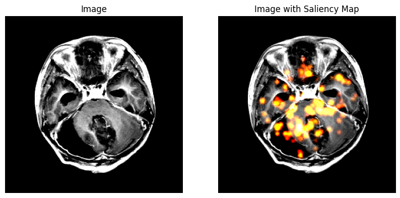

# Brain-Tumor-Classification
Brain Tumor Classification using Transfer Learning Inception V3

## Setup
Clone the Repository
```
git clone git@github.com:jesdin/Brain-Tumor-Classification.git
cd Brain-Tumor-Classification
```

Create and Activate Conda Environment. Install required libraries
```
conda create -n bt_class python=3.10.9
conda activate bt_class
pip install -r requirements.txt
```

Create Directories for Data and Model
```
mkdir data
mkdir model
```

Download the Dataset
```
kaggle datasets download -d masoudnickparvar/brain-tumor-mri-dataset --unzip -p ./data

```

## Results
| Metric         | Value  |
|---------------|--------|
| Test Accuracy | 0.9741 |
| Test AUC      | 0.9986 |

**Confusion Matrix**
|                | Glioma | Meningioma | No Tumor | Pituitary |
|--------------|--------|-----------|----------|-----------|
| **Glioma**      | 280    | 19        | 0        | 1         |
| **Meningioma**  | 1      | 298       | 5        | 2         |
| **No Tumor**    | 0      | 1         | 404      | 0         |
| **Pituitary**   | 1      | 4         | 0        | 295       |

